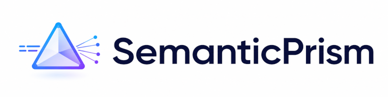
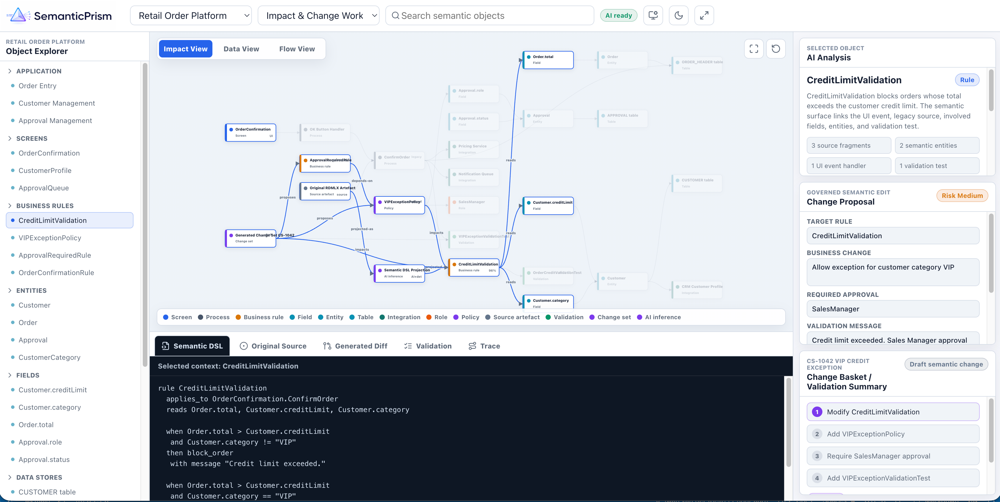

# Semantic Prism

[](https://choosealicense.com/licenses/mit/)


[](https://react.dev/)
[](https://www.typescriptlang.org/)
[](https://vitejs.dev/)
[](#contributing--principles-of-participation)



> Semantic Prism is a personal research and prototype project for AI-native semantic engineering: an AI-native visual workbench that turns complex software systems into traceable text, canvas and control surfaces.


Semantic Prism is not a code editor, not a low-code tool, and not an IDE clone. It explores a semantic-workbench approach to complex implementation substrates — legacy systems, generated code, 4GL platforms, agentic runtimes, configuration-heavy systems, greenfield application models — through user-appropriate views: business-readable descriptions, visual dependency maps, process and data diagrams, source-code and pseudo-code views, generated DSL representations, forms, dashboards, review panels and more.

The core thesis: users should not have to work directly against raw implementation artefacts by default. They should work with AI-assisted semantic surfaces that remain traceable to the real underlying system, with every proposed change captured as a reviewable, governed change set — never a silent mutation.

## Core concepts

Semantic Prism is built around three bidirectional surface types, composed into task-oriented workspaces:

- **Text Surface** — source code, generated DSL, pseudo-code, configuration, diffs, logs and AI-generated explanations.
- **Canvas Surface** — dependency graphs, application maps, entity-relationship and data-flow diagrams, process flows, architecture maps and AI-generated semantic diagrams.
- **Control Surface** — forms, dashboards, review panels, validation panels, wizards and change-set/approval controls.

A **Semantic Workspace Manager** composes these surfaces into synchronized, task-oriented workspaces (e.g. *Impact Analysis Workspace*, *Business Rule Workspace*, *Change Review Workspace*). A **Context Bus** keeps selection and focus aligned across every projection of the same semantic object. A **Command Router** converts human and AI interaction into semantic commands, and every proposed modification passes through a **Change-Set and Validation** layer before anything is considered applied.

Guiding principles: semantic meaning first, implementation always traceable; every surface is a potential interaction surface, not just a viewer; the AI participates through typed, registered surface descriptors — never arbitrary generated UI; and every change is reviewable before it is treated as real.

## AI-native by design

AI is not treated as a side panel or isolated assistant in Semantic Prism. It is incorporated across the full interaction model.

AI helps analyse complex systems, explain semantic objects, reconstruct business rules, generate alternative projections, compose task-specific workspaces, create diagrams, prepare control panels, propose changes, generate validation checklists, summarize impact and support review.

The user does not interact only with raw code or static diagrams. The user works with AI-assisted semantic surfaces: text, canvas and control views that can be generated, enriched, explained and updated through governed AI interaction.

At the same time, AI does not silently mutate underlying systems. AI-created interpretations and changes remain traceable to source artefacts, evidence, semantic commands, change sets and validation results. The system is AI-native, but reviewable and governed.

## Primary users

- **Business / domain users** who need readable process and rule views without exposure to raw code.
- **Application maintainers** who move between semantic and implementation views without losing traceability.
- **Legacy / platform experts** (COBOL, LANSA, RPG, PL/SQL, generated Java, agentic runtimes, etc.) who need original-artefact truth and precise diffs.
- **Architects** reasoning about structure, dependency, risk and modernization strategy.
- **Reviewers / governance users** evaluating whether a proposed change is safe, auditable and compliant.
- **AI agents**, which participate in the UI as first-class citizens — composing workspaces and proposing changes, but only through governed, typed UI descriptors.

## This repository

This repository currently contains the project specification and a local, runnable prototype mock-up implementing it.

### `semantic-prism-mock/` — local HTML mock-up

A client-side-only React + TypeScript + Vite application that demonstrates the interaction model end-to-end through one scripted narrative: investigating a customer credit-limit validation rule and proposing a VIP-customer exception, across a synchronized Canvas Surface (impact graph), Text Surface (DSL, original source, diff, validation, trace) and Control Surfaces (AI analysis, change proposal, change basket). No backend, authentication, database or real AI/validation engine is required.



Run it locally:

```bash
cd semantic-prism-mock
npm install
npm run dev
```

Tech stack: React, TypeScript, Vite, D3.js (canvas rendering), Dagre (directed graph layout), CodeMirror (text surfaces).

### `specs/`

- [`Semantic Prism - Client-Side UI Specification.md`](./specs/Semantic%20Prism%20-%20Client-Side%20UI%20Specification.md) — the parent UI specification: surface types, workspace composition, navigation, AI interaction, traceability, collaboration/review, visual design and performance requirements.
- [`Semantic Prism — Local HTML Mock-Up Specification.md`](./specs/Semantic%20Prism%20%E2%80%94%20Local%20HTML%20Mock-Up%20Specification.md) — the concrete implementation specification for the `semantic-prism-mock/` demo: tech stack, layout, mock data, scripted interactions and acceptance criteria.

### `openspec/`

Spec-driven change proposals (proposal, design, capability specs and tasks) tracked with [OpenSpec](https://github.com/Fission-AI/OpenSpec), including the change that produced the current mock-up.

## Project status

Version 0.1 — early-stage specification plus an illustrative mock-up. This is a scripted demonstration of the interaction model, not a functional platform: no backend, no real AI integration, no persistence. See the specifications in `specs/` for the full project vision and the explicit non-goals of the current mock-up.


---

## Contributing & Principles of Participation

Pull requests are welcome. For major changes, open an issue first to discuss the approach.

There is no automated test suite yet. If you add one, please keep it passing before opening a pull request.

Everyone is welcome to contribute: open issues, propose pull requests, share ideas, or improve documentation. Participation is open to all, regardless of background or viewpoint.

This project follows the [FOSS Pluralism Manifesto](./FOSS_PLURALISM_MANIFESTO.md), which affirms respect for people, freedom to critique ideas, and space for diverse perspectives.

---

## Copyright and License

Copyright © 2026 Iwan van der Kleijn

Licensed under the [MIT License](https://choosealicense.com/licenses/mit/). See the [LICENSE file](./LICENSE) in the repository.
