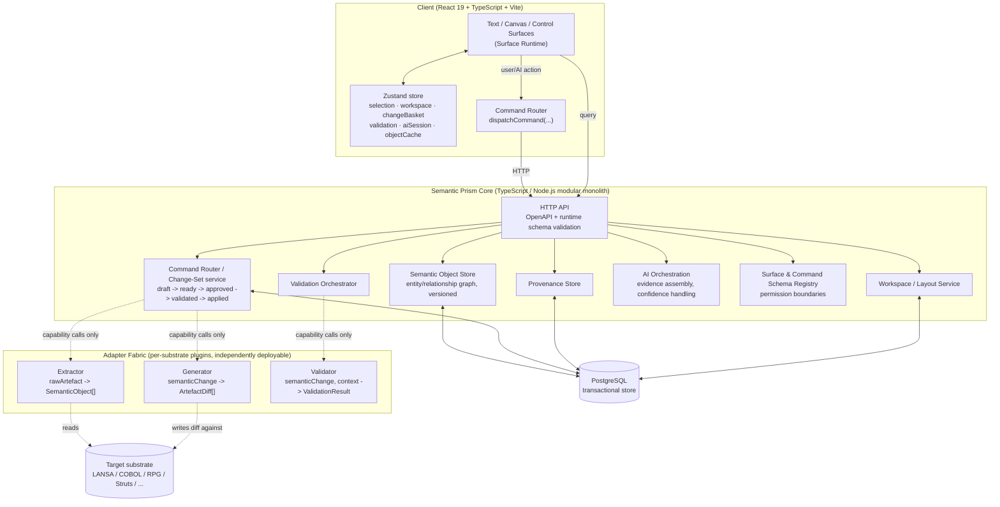
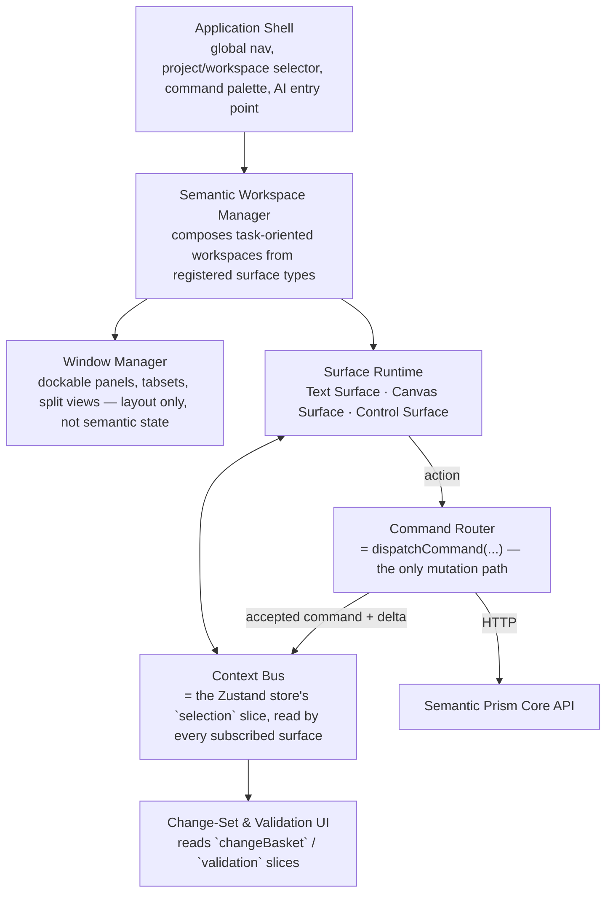
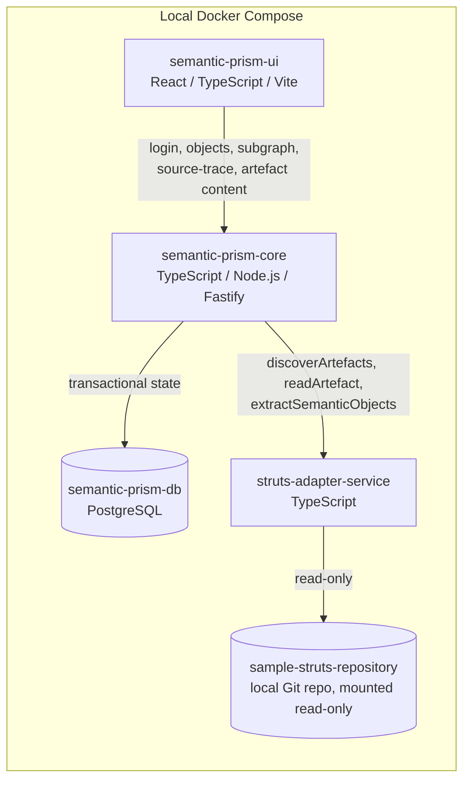
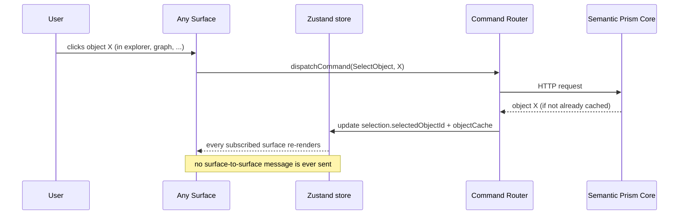

# Semantic Prism — Architecture Diagram

Internal working name: Semantic Prism
Scope: visual reference for the architecture defined in the other specs — no new decisions
Version: 0.1

This document adds no new decisions. It is a Mermaid visual reference for what's already specified in:

* [Semantic Prism - Client-Side UI Specification.md](Semantic%20Prism%20-%20Client-Side%20UI%20Specification.md) — six conceptual UI layers, surface types.
* [Semantic Prism - State and Backend Architecture Specification.md](Semantic%20Prism%20-%20State%20and%20Backend%20Architecture%20Specification.md) — store slices, command-only mutation, generic-core/adapter split.
* [Semantic Prism - ADR 0001 - Backend Implementation Language.md](Semantic%20Prism%20-%20ADR%200001%20-%20Backend%20Implementation%20Language.md) — TypeScript core / Rust-where-justified adapters.
* [Semantic Prism R1 - Semantic Core, Struts Adapter and Implementation Architecture.md](Semantic%20Prism%20R1%20-%20Semantic%20Core%2C%20Struts%20Adapter%20and%20Implementation%20Architecture.md) — R1's concrete topology and scope.

If a diagram here and its source spec ever disagree, the spec is authoritative — update the diagram to match, not the other way around.

## 1. System architecture: generic core, substrate adapters

The backend splits along one seam: concepts true for any target system (the core) versus logic specific to a given substrate (adapters). The client never talks to an adapter directly.

Key invariants this diagram encodes (see ADR 0001 and Backend spec §3.5, §6.7):

* The client never calls an adapter directly — only the Core API.
* The Core never contains substrate-specific logic — only the three plugin interfaces (`Extractor`, `Generator`, `Validator`).
* `objectCache` in the client store is a read replica; the Core's Semantic Object Store is authoritative.

## 2. Client-side conceptual layers

The six layers from the UI spec (§6), with the store/command wiring from the Backend spec (§3) inserted underneath:

Note: the Window Manager is layout-only infrastructure (Backend spec §3.4) — it never carries `selection` or `objectCache` state, which is why it branches off `Workspace Manager` rather than sitting in the `Runtime <-> Context Bus` data path.

## 3. R1 concrete topology

The subset of the above that R1 actually builds and runs (R1 spec §24, §12): read-only, one substrate (Struts), no change-basket/validation execution.

Allowed R1 commands: `SelectObject`, `OpenSourceTrace`, `OpenArtefact`, `RunExtraction`, `SaveWorkspaceLayout`, `ResetWorkspaceLayout`. Everything else in §1's `CmdSvc` (propose/commit/validate/apply/rollback) exists as typed definitions only and does not execute in R1.

## 4. Data flow: object selection (generic, applies from R1 onward)

The one synchronization pattern the whole client architecture reduces to (Backend spec §2, §5.1) — no surface ever messages another surface directly.

